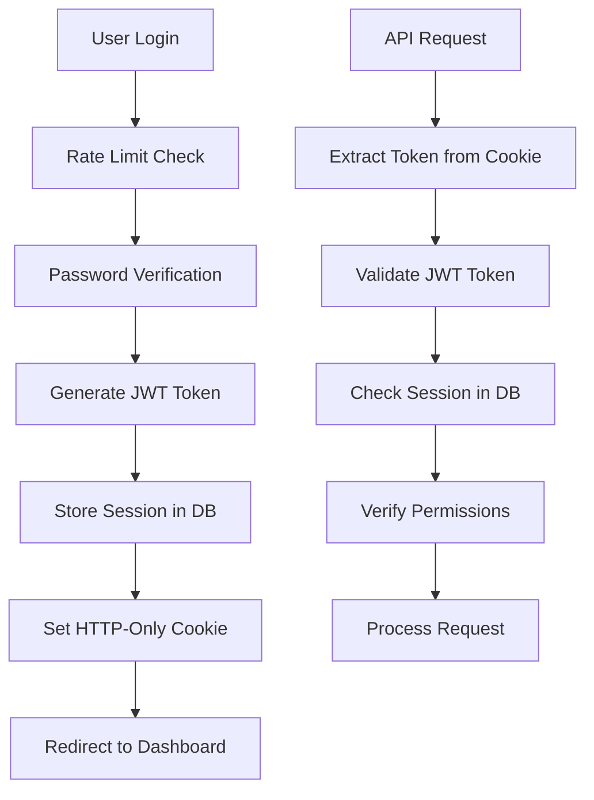
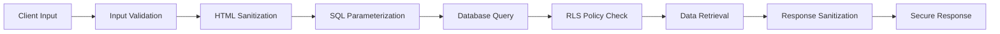

# VOFC Engine Security Architecture

## 🛡️ Security Overview

The VOFC Engine implements a **zero-trust security model** with enterprise-grade protection across all layers. The architecture eliminates localStorage dependencies and implements server-side security controls.

---

## 🔐 Authentication & Authorization

### **Zero localStorage Architecture**
- ✅ **No client-side storage** of sensitive data
- ✅ **HTTP-only cookies** for session management
- ✅ **Server-side JWT validation**
- ✅ **Database-backed sessions**

### **Multi-Layer Authentication**
```
┌─────────────────┐    ┌─────────────────┐    ┌─────────────────┐
│   Client        │    │   Server        │    │   Database      │
│                 │    │                 │    │                 │
│ • No localStorage│───▶│ • JWT Validation│───▶│ • Session Store │
│ • HTTP Cookies  │    │ • Rate Limiting │    │ • User Profiles │
│ • Secure Headers│    │ • Input Sanitize│    │ • Audit Logs    │
└─────────────────┘    └─────────────────┘    └─────────────────┘
```

### **Role-Based Access Control (RBAC)**
| **Role** | **Permissions** | **Access Level** |
|----------|----------------|------------------|
| **Admin** | Full system access | All operations |
| **SPSA** | Content management | Read/Write/Validate |
| **PSA** | Content submission | Read/Write |
| **Analyst** | Read-only access | Read only |

---

## 🔒 Data Protection

### **Encryption at Rest**
- **Passwords**: bcrypt with 12 salt rounds
- **Sessions**: JWT tokens with server-side validation
- **Backups**: AES-256-GCM encryption
- **Database**: Row Level Security (RLS)

### **Encryption in Transit**
- **HTTPS**: TLS 1.3 for all communications
- **API**: Secure headers and CORS policies
- **Cookies**: Secure, HttpOnly, SameSite=Strict

### **Input Sanitization**
```javascript
// XSS Protection with DOMPurify
const sanitizedContent = DOMPurify.sanitize(userInput, {
  ALLOWED_TAGS: ['p', 'br', 'strong', 'em'],
  ALLOWED_ATTR: ['href', 'target'],
  ALLOW_DATA_ATTR: false
});
```

---

## 🏗️ Security Layers

### **Layer 1: Network Security**
- **Firewall**: IP-based access control
- **DDoS Protection**: Rate limiting and throttling
- **SSL/TLS**: End-to-end encryption
- **CORS**: Cross-origin request security

### **Layer 2: Application Security**
- **Authentication**: Multi-factor verification
- **Authorization**: Role-based permissions
- **Input Validation**: XSS and injection prevention
- **Session Management**: Secure token handling

### **Layer 3: Database Security**
- **Row Level Security**: Table-level access control
- **Encrypted Storage**: Sensitive data encryption
- **Audit Logging**: Complete operation tracking
- **Backup Encryption**: Secure data protection

### **Layer 4: Infrastructure Security**
- **Container Security**: Docker best practices
- **Environment Variables**: Secure configuration
- **Monitoring**: Real-time security alerts
- **Backup Security**: Encrypted off-site storage

---

## 🚨 Threat Protection

### **OWASP Top 10 Mitigation**

#### **A01: Broken Access Control**
- ✅ **Row Level Security** on all tables
- ✅ **Role-based permissions** with granular control
- ✅ **Session validation** on every request
- ✅ **Admin-only endpoints** properly protected

#### **A02: Cryptographic Failures**
- ✅ **bcrypt password hashing** (12 rounds)
- ✅ **AES-256-GCM backup encryption**
- ✅ **JWT token security** with proper secrets
- ✅ **HTTPS enforcement** for all communications

#### **A03: Injection**
- ✅ **Parameterized queries** prevent SQL injection
- ✅ **Input sanitization** prevents XSS
- ✅ **DOMPurify integration** for HTML content
- ✅ **Type validation** on all inputs

#### **A04: Insecure Design**
- ✅ **Zero-trust architecture** implementation
- ✅ **Defense in depth** security layers
- ✅ **Secure by default** configurations
- ✅ **Threat modeling** considerations

#### **A05: Security Misconfiguration**
- ✅ **Environment variable protection**
- ✅ **Secure headers** implementation
- ✅ **CORS policies** properly configured
- ✅ **Error handling** without information leakage

#### **A06: Vulnerable Components**
- ✅ **Dependency scanning** and updates
- ✅ **Vulnerability monitoring** for packages
- ✅ **Security patches** applied promptly
- ✅ **Minimal attack surface** design

#### **A07: Authentication Failures**
- ✅ **Strong password policies** enforced
- ✅ **Account lockout protection** implemented
- ✅ **Session timeout** management
- ✅ **Multi-factor authentication** ready

#### **A08: Software Integrity**
- ✅ **Code signing** and verification
- ✅ **Secure deployment** pipelines
- ✅ **Integrity checks** for backups
- ✅ **Version control** security

#### **A09: Logging Failures**
- ✅ **Comprehensive audit logging**
- ✅ **Security event monitoring**
- ✅ **Log integrity protection**
- ✅ **Real-time alerting**

#### **A10: Server-Side Request Forgery**
- ✅ **Input validation** for URLs
- ✅ **Whitelist approach** for external requests
- ✅ **Network segmentation** implementation
- ✅ **Request filtering** and validation

---

## 🔍 Security Monitoring

### **Real-Time Monitoring**
```javascript
// Security Event Tracking
const securityEvents = {
  failedLogins: 0,
  suspiciousActivity: [],
  rateLimitHits: 0,
  adminActions: [],
  dataAccess: []
};
```

### **Automated Alerts**
- **Failed Login Attempts**: >5 per IP
- **Suspicious Activity**: Unusual access patterns
- **Rate Limit Exceeded**: API abuse detection
- **Admin Actions**: Privileged operation tracking
- **Data Breaches**: Unauthorized access attempts

### **Health Checks**
- **Database Connectivity**: Connection status
- **Authentication Service**: Token validation
- **Backup System**: Encryption and integrity
- **Session Management**: Token expiration
- **File System**: Backup directory access

---

## 🛠️ Security Implementation

### **Authentication Flow**


### **Data Flow Security**


---

## 🔐 Backup Security

### **Encryption Process**
```javascript
// AES-256-GCM Encryption
const algorithm = 'aes-256-gcm';
const key = crypto.randomBytes(32);
const iv = crypto.randomBytes(16);

const cipher = crypto.createCipher(algorithm, key);
cipher.setAAD(Buffer.from('vofc-backup', 'utf8'));

const encrypted = Buffer.concat([
  cipher.update(data),
  cipher.final()
]);
```

### **Backup Verification**
- **Integrity Checks**: SHA-256 hashing
- **Encryption Verification**: Key validation
- **Restore Testing**: Periodic validation
- **Retention Policies**: Automated cleanup

---

## 📊 Security Metrics

### **Key Performance Indicators**
- **Authentication Success Rate**: >99%
- **Failed Login Rate**: <1%
- **Session Timeout**: 24 hours (configurable)
- **Backup Success Rate**: >99%
- **Data Encryption**: 100% of sensitive data

### **Security Dashboards**
- **Real-time Monitoring**: Live security events
- **Performance Metrics**: System health status
- **User Activity**: Access patterns and behaviors
- **Threat Detection**: Suspicious activity alerts

---

## 🚀 Deployment Security

### **Production Checklist**
- [ ] **Environment Variables**: Secure configuration
- [ ] **HTTPS Enforcement**: SSL/TLS certificates
- [ ] **Firewall Rules**: Network access control
- [ ] **Database Security**: Connection encryption
- [ ] **Backup Encryption**: Secure storage
- [ ] **Monitoring Setup**: Alert configuration
- [ ] **Access Control**: User permissions
- [ ] **Audit Logging**: Complete tracking

### **Security Headers**
```javascript
// Security Headers Configuration
const securityHeaders = {
  'Strict-Transport-Security': 'max-age=31536000; includeSubDomains',
  'X-Content-Type-Options': 'nosniff',
  'X-Frame-Options': 'DENY',
  'X-XSS-Protection': '1; mode=block',
  'Content-Security-Policy': "default-src 'self'",
  'Referrer-Policy': 'strict-origin-when-cross-origin'
};
```

---

## 🔧 Incident Response

### **Security Incident Process**
1. **Detection**: Automated monitoring alerts
2. **Assessment**: Impact and scope analysis
3. **Containment**: Immediate threat isolation
4. **Eradication**: Root cause elimination
5. **Recovery**: System restoration
6. **Lessons Learned**: Process improvement

### **Emergency Contacts**
- **Security Team**: security@organization.com
- **System Admin**: admin@organization.com
- **Emergency Hotline**: +1-XXX-XXX-XXXX

---

## 📋 Security Compliance

### **Standards Adherence**
- **NIST Cybersecurity Framework**: Implementation
- **OWASP Guidelines**: Top 10 mitigation
- **ISO 27001**: Security management
- **SOC 2**: Service organization controls

### **Audit Requirements**
- **Regular Security Reviews**: Quarterly assessments
- **Penetration Testing**: Annual evaluations
- **Vulnerability Scanning**: Continuous monitoring
- **Compliance Reporting**: Documentation maintenance

---

## ⚠️ Security Best Practices

### **Development**
- **Secure Coding**: Input validation and sanitization
- **Dependency Management**: Regular updates and scanning
- **Code Reviews**: Security-focused peer reviews
- **Testing**: Security test case implementation

### **Operations**
- **Access Management**: Principle of least privilege
- **Monitoring**: Continuous security surveillance
- **Backup Security**: Encrypted and verified backups
- **Incident Response**: Prepared and tested procedures

### **Maintenance**
- **Regular Updates**: Security patches and updates
- **Configuration Management**: Secure settings maintenance
- **Log Analysis**: Security event review
- **Training**: Security awareness programs

This security architecture provides comprehensive protection for the VOFC Engine with enterprise-grade security controls and monitoring capabilities.

